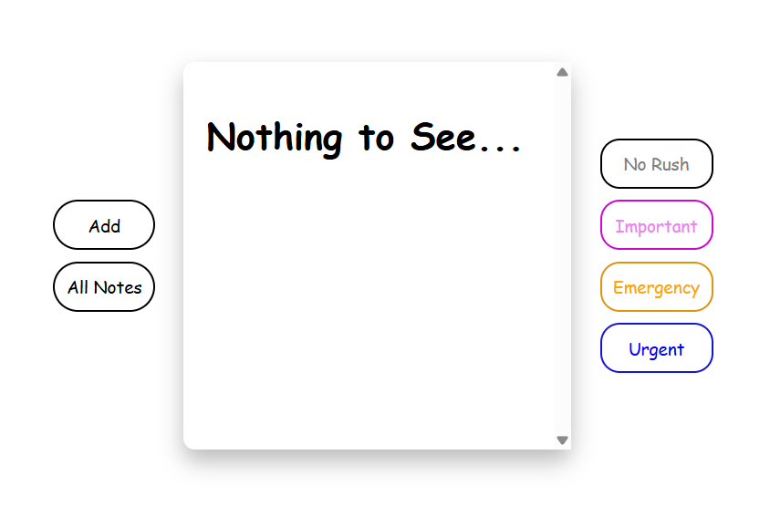
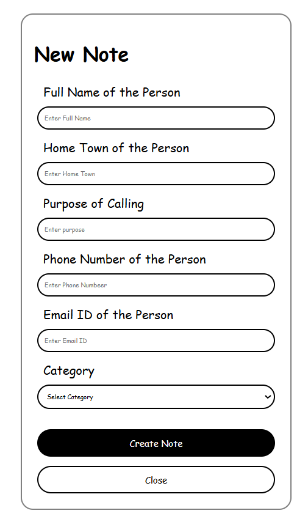

# Priority Notes Manager

A simple and interactive Priority Notes Manager web app built using HTML, CSS, and JavaScript.

This project allows users to create notes, organize them by priority level, and manage them with filtering and delete functionality.

---

## 🚀 Features

- Create new notes dynamically
- Priority-based categorization
- Filter notes by urgency
- Delete notes
- Call and Email action buttons
- Interactive UI with hover effects
- Clean and minimal design

---

## 🛠️ Technologies Used

- HTML5
- CSS3
- JavaScript (Vanilla JS)

---

## 📂 Project Structure

```bash
├── index.html
├── style.css
├── script.js
└── images/
    └── screenshot.png
```

---

## 📸 Screenshots





---

## 🎯 Functionalities

### Categories Available

- No Rush
- Important
- Emergency
- Urgent

### Actions

- Add Note
- Delete Note
- Filter Notes
- Call Contact
- Send Email

---

## 📚 What I Learned

This project helped me practice:

- DOM Manipulation
- Event Handling
- Dynamic Element Creation
- Form Handling
- JavaScript Functions
- CSS Styling
- UI Design Basics

---

## 🔮 Future Improvements

- Save notes using Local Storage
- Add edit functionality
- Improve responsiveness
- Add animations
- Add dark mode
- Add search functionality

---

## 📌 Author

Made with ❤️ by Anshu Kharwar.
